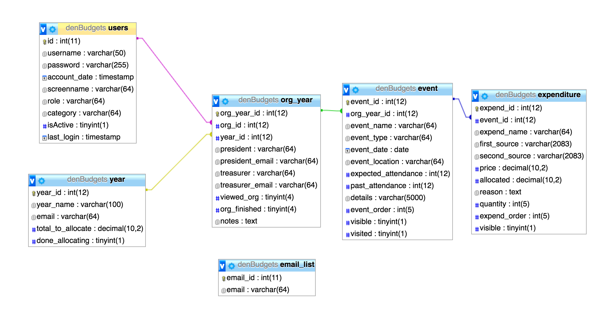

# WilburProject
#### Web app project to streamline budgeting process for student government.
===================

## Tools & Libraries
During this project I've used many different types of tools. At the beginning I used Meteor.js, but I wasn't satisified with the performance or setup, so I switched to PHP. I've gone through two different PHP iterations after learning some interesting style patterns and things I did horribly wrong in the first iteration. I also changed the site to a material design feel. Aside from PHP, I'm using jQuery, jEditable, Chart.js, and a lot of homegrown JS. It's been a work in progress but it'll be great to see it implemented.

## Database Model
Attached is a photo of the database model used. It's working pretty well so far and has a lot of efficiency changes to be made. I plan on adding a collaboration table and collaboration users table to set up the collaborative budgets side of things.

